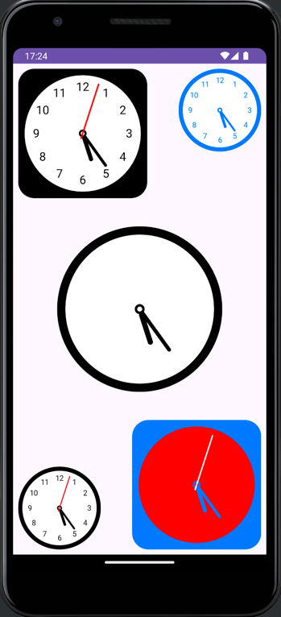

# Vk Test Application

В приложении представлена реализация custom view в виде аналоговых часов следующего вида:

## В приложении реализована следующая функциональность:
* Удобное взаимодействие разработчика с компонентом (добавление через xml или через код)
* Гибкая настройка компонента (возможность изменения цветов, формы, размера и т. д. с помощью атрибутов или применения готовых стилей)
* Корректная работа часов (всегда показывают точное время, не зависят от смены конфигураций)
* Оптимизация и внимание к деталям (например, если разработчик решил добавить вариант часов без секундной стрелки, обновление будет происходить раз в минуту)
* Привлекательный минималистичный дизайн, следующий Material Guidelines

Для отрисовки элементов view используется Canvas